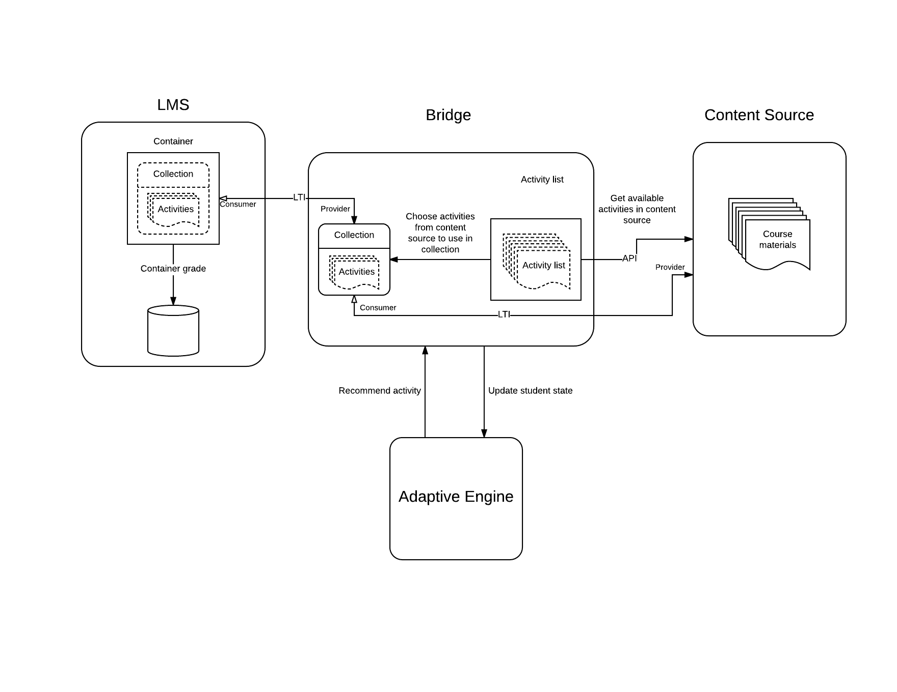

# Bridge for Adaptivity

[](https://travis-ci.org/harvard-vpal/bridge-adaptivity)
[](https://codeclimate.com/github/harvard-vpal/bridge-adaptivity)

## About

An application that interfaces with an adaptive engine to dynamically serve
content in MOOCs based on real time student activity.

### The ALOSI adaptivity ecosystem
The Bridge for Adaptivity is designed to work with three external
systems to enable adaptivity in a course. These are:
* LMS (Learning Management System), for example edX, Open edX, Canvas or
other LTI consumers
* Content Source - contains the content (problems, html content) to
serve dynamically. Examples of a content source system might be Open edX
or other LTI providers.
* Adaptive Engine - Provides activity recommendations based on student activity.
An example of an adaptive engine application is the [ALOSI adaptive engine](https://github.com/harvard-vpal/adaptive-engine).


### More information

Visit our [github wiki](https://github.com/harvard-vpal/bridge-adaptivity/wiki)
or the [ALOSI Labs site](http://www.alosilabs.org/) for more information about
our group and our work.

## Getting started

### Deployment

Deployment is based on the `Docker` containers. There are two config
files `docker-compose_local.yml` and `docker-compose.yml` for local
and production deployments respectively.

Docker and Docker Compose are required to be installed before start
the deploying.

Clone project.

Before running deployment configure `secure.py` settings in the
`bridge_adaptivity/config/settings/` directory (see
`secure.py.example`).

### Local deployment

Local deployment can be started by the docker-compose up command in the
console:

    [sudo] docker-compose -f docker-compose_local.yml up

Local deployment contains two containers:

- BFA_local -- container with the Bridge for Adaptivity.

- postgresql_BFA -- container with the postgresql database.

  Volume "pgs" is added to the the database container.

  Note: Development server available on `localhost:8008`


### Running tests

You can run test locally (directly on your host) and in the docker machine

* to run hosts locally:
 * install requirements with command `pip install -r requirements_local.txt`
 * run command: `python manage.py test --settings config.settings.test` or just `pytest`. Both these commands are equal
* to run tests in docker:
 * up docker container with command: `docker-compose -f docker-compose_local.yml up -d`
 * run test `docker exec -it BFA_local pytest`
  * if you see an error:
  ```
  import file mismatch:
  ...
which is not the same as the test file we want to collect:
  /bridge_adaptivity/config/settings/test.py
HINT: remove __pycache__ / .pyc files and/or use a unique basename for your test file modules
  ```
  you should do this: `find . | grep -E "(__pycache__|\.pyc|\.pyo$)" | xargs rm -rf`
  and after that run tests: `docker exec -it BFA_local pytest`


### Production deployment

Please ensure that file in `nginx/sites_enabled/bridge.conf` exists and
is configured in proper way.

Run docker-compose up command with default `docker-compose.yml` file
to start production deployment:

    sudo docker-compose up -d

Production deployment contains three containers:

- BFA -- container with the the Bridge for Adaptivity.

  Bridge for Adaptivity application is running on gunicorn server.

- postgresql_BFA -- container with the postgresql database.

  Volume "pgs" is added to the the database container.

- nginx_BFA -- container with nginx server

### Additional notes

- if `requirements` changes were made containers rebuilding needed:

production:

    [sudo] docker-compose -f docker-compose.yml build

development:

    [sudo] docker-compose -f docker-compose_local.yml build


### Changing Grading policy:
Each collection could has personal grading policy.
To switch between policies marl/unmark `correctness meters` flag while updating/creating collection or in admin UI.

If `correctness_meter` is checked grade depends on the users points,
If unchecked: grade depends on the users trials count.
